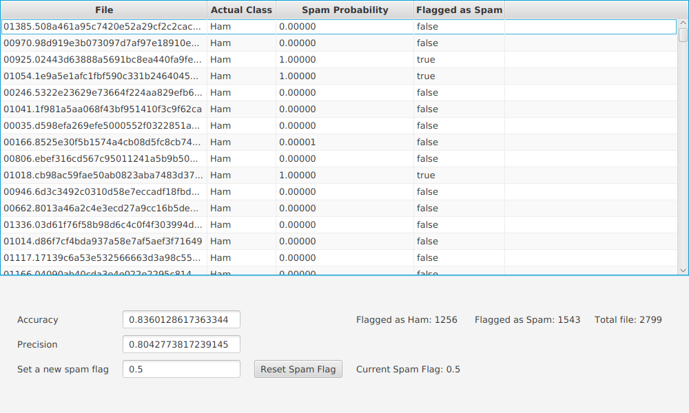

<h1>Spam E-mail Flagger</h1>  

<h2>Overview</h2>

 
    This program goes through files and gives a table showing whether or not said file is a spam message. 

    It goes through training files, where it finds words that are commonly used in spam and ham messages, then it applies its finding in test files, giving them a probability of being spam or not. It gives the user a table showing the probability of being a spam, the actual class of the message, and a boolean telling the user whether or not the message is a spam based on a flagging cutoff. It also gives the accuracy and the precision of the flagging algorithm.

    The program will also let the user see the total number of files, the number of flagged spam and ham messages, and will let the user change the cutoff at which the program will flag the messages.

 

<h2>Improvements over base instructions</h2>

    1. The tableview will have dynamic flagging: it shows which files are flagged by the cutoff.

    2. The user can change the cutoff at which the program will flag the files.

    3. The program will show the number of files, and how many of them are flagged as spam or as ham.

    4. Does not count the small words since they tend to be present in both typed of messages, thus increasing accuracy.

    5. Made the background azure colored.

  

<h2>How to run </h2>

    Before you run the program, you will want to have a specific file structure on you computer. You want a folder containing 2 folder called "train" and "test". The "train" folder will contain 3 folders: "ham", "ham2", and "spam". Those folders will contain text files, which the program will read to get a map of the probability of words being in a spam or ham folder. The "test" folder will contain 2 folders: "ham" and "spam". Those folders will contain text files which will be used to test the program.

    Once those folders are in place, you will be able to run the program. The first thing that you will be asked to do is to select the folder containing the "train" and "test" folders. The program will then be trained and show you its classification of the files in the "test" folder. You will be able to change the cutoff and see how the accuracy and precision change based on the cutoff.

    You will be able to close the program by exiting the window.

  

<h2>Libraries and Ressources Used</h2>

    The project mainly used the javafx library and the java Math library.  
    It also adapted the WordCounter file made in the module 5 tutorials.

